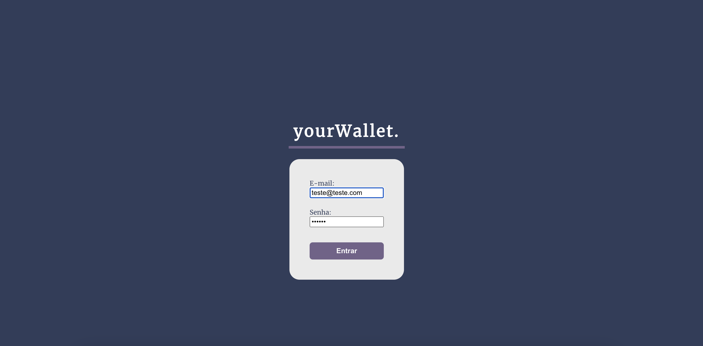
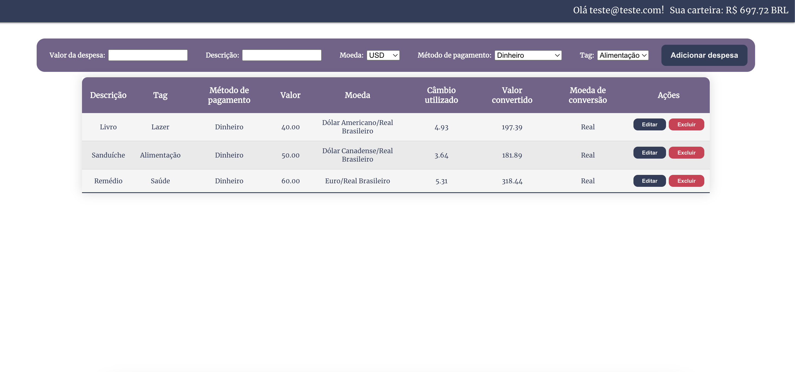

# Trybewallet

🇧🇷: Aplicação que computa gastos em diferentes moedas, convertendo tudo para uma única moeda escolhida pelo usuário. Desenvolvida como projeto do módulo de Front-End da Trybe! 
🇺🇸: Application that computes expenses in different currencies, converting everything to a single currency chosen by the user. This project was developed as Trybe's coursework for the Front-End module.

## Skills
- API [Cotação de Moeda](https://docs.awesomeapi.com.br/api-de-moedas);
- React.js;
- Redux;
- CSS.

## How to run it

    1. Clone the repository or fork it;
    2. Run `npm install`;
    3. Run `npm start`!

Open [http://localhost:3000](http://localhost:3000) to view it in your browser.

Or check it out live [Here!](https://trybewallet-mauve.vercel.app/)

🇺🇸: To log in, simply but any email with a valid format and any password with at least 6 characters.  
🇧🇷: Para fazer o login, basta digitar um email num formato válido e qualquer senha com pelo menos 6 caracteres.

### Screenshots
 

